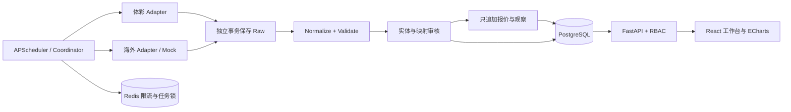

# Architecture

React 19 + TypeScript + Vite + Ant Design + TanStack Query + React Router + ECharts。
FastAPI + SQLAlchemy 2 + Alembic + PostgreSQL + Redis + APScheduler。

Python 使用单发行包 `apps/api/src/jc`，按 providers、ingestion、entities、odds、jobs 划分边界。
不重复建立可独立运行的微服务，避免无必要的部署复杂度。任务接口可由 Celery 接管。
请求链路：Adapter → 独立事务保存 Raw → Normalize → Validate → 业务事务。
前端不直接访问数据供应商。生产通过 Nginx 同源代理，数据库与 Redis 不暴露公网端口。

## 运行结构



`services/*` 和 `packages/*` 文档说明逻辑边界，不是假装独立部署的微服务。容器采用单 API worker，避免每个 worker 启动独立调度器。

| 边界 | 实现 | 职责 |
| --- | --- | --- |
| Provider SDK | providers/base.py、contracts.py | 统一采集、标准模型、历史能力、错误契约 |
| 传输 | providers/http.py | Raw 优先落库、超时、有限重试、限流、脱敏 |
| 采集 | ingestion.py | 原始事务与业务事务分离、来源隔离、运行记录 |
| 实体 | entities.py、admin.py | UUID 身份、评分、歧义、审核、版本与审计 |
| 赔率 | odds.py、odds_api.py | 批量去重、历史可见性、变化与固定标签 |
| 调度 | jobs.py | 每源独立任务、动态周期、Redis 账号级限速与锁 |
| 管理 | quality.py、auth.py | 数据质量、同步、用户、审计、角色鉴权 |
| 展示 | apps/web/src | 今日比赛、详情、七项导航和登录注册 |

业务层只依赖统一 Adapter。真实供应商与公司不是同一概念：The Odds API 是 provider，其返回的 Pinnacle 等是 bookmaker。只有体彩 Adapter 可以创建主比赛池；外部孤立赛事保存在 provider_matches，不扩大主池。

Raw 在独立事务提交后才解析；验证失败时业务事务回滚，Raw 与失败任务继续可查。映射不确定时保留候选进入 REVIEW/UNMATCHED。时间改变会让确认失效，历史报价保留原绑定版本。

认证采用 Argon2 密码哈希、短期 JWT、哈希存储的刷新令牌轮换和会话撤销。注册只能创建 USER；审核和变更要求 ADMIN，ANALYST 可读取受控管理数据。浏览器令牌只放内存，页面刷新需重新登录。读接口使用统一 JSON 信封和 request_id。

未来可将 Coordinator.execute 作为 Celery 任务入口。当前不引入消息总线、分布式微服务或投注服务。P4-0～P4-2 增加单包 analysis 模块，构建事实 Feature，不运行预测模型。容量、备份和生产加固计划见 BACKLOG 与 OPERATIONS。

认证入口在 Argon2 校验前调用 auth_limits.py。PG 原子 UPSERT 有条件递增配额，限流预算先独立提交，随后 401/409 不会撤回计数；Redis 故障时仍有数据库限流保护。短期桶仅保存带服务密钥的 HMAC 标识，过期清理，不记录原始邮箱、IP 或密码。数据来源限流仍由 Redis 承担，两个边界互不替代。

P4 的 results.py 消费统一 FINAL/REGULATION Contract，继续 Provider → Raw → Normalize → Validate → Store，不建新调度或服务。analysis/visibility.py 在提交后通过独立连接确认不可变输入可见，analysis/features.py 同时检查这些凭据、业务/Raw 时间、历史 MatchVersion 和映射审计，输出独立 append-only FeatureSnapshot。详情展示 API 的历史语义未改；不能将其直接当 Feature 输入。规则及旧数据保守边界见 PHASE4_SPEC。

P4-3 增加 `analysis/market.py` 纯 Decimal 计算和 `analysis/market_snapshots.py` 持久化边界：

```text
Raw / Odds → 原有 Feature 构建器 @ analysis_cutoff → 不可变 FeatureSnapshot
                                                     ↓ 仅冻结 JSON
                                              market-v1 纯计算
                                                     ↓
                                          不可变 MarketModelSnapshot
```

Market 服务只按 ID 读取一个 FeatureSnapshot，并按 `(feature_snapshot_id, market_model_version)` 查找或追加结果；不查询赔率、当前比赛、比赛版本、Provider 状态或 API。复用 odds.py 的通用 INSERT 去重 helper，该 helper 不查询赔率。API 先调用原有 Feature 服务，再调用 Market 服务；原有 ORM after_commit 可见性扫描不变，Market 不增加历史扫描。

V1 每个 `(provider, bookmaker)` 独立验证完整性、proportional 去水，外部完整 1X2 等权形成 `P_market`。体彩完全排除于外部共识，只输出自身定价及与外部均值之差。亚洲二项盘口和体彩 HHAD 三项、TOTALS 和体彩 TTG 八项各自独立；不做概率空间转换。无预测、推荐或 EV。详见 [ADR-009](DECISIONS/ADR-009-market-probability-baseline.md)。

P4-4A 增加单个标准库模块 `analysis/score_matrix.py`，边界独立于数据读取与持久化：

```text
显式 Decimal lambda_home / lambda_away / rho
                    ↓
score-math-v1：动态 Poisson 边缘 → DC 四格修正 → 统一归一化矩阵
                    ↓
        1X2 / 整数 HHAD / 总进球 / 体彩 TTG
```

仅为纯数学转换器；不读取 Feature/Odds/Market Snapshot、DB、网络或时钟，不估计参数，不创建预测表/API，也不接入前端。50 位 Decimal、每侧尾部界 1e-12、最高 30 球；不足则显式失败，保留截断与归一化元数据。所有派生概率来自同一矩阵，JSON 核心概率为字符串。详见 [ADR-010](DECISIONS/ADR-010-score-probability-math.md)。

P4-4B1 增加 `analysis/goals_baseline.py` 纯函数，复用该数学引擎：

```text
历史 DB → 原 Feature 构建器 @ analysis_cutoff → Frozen FeatureSnapshot
                                                     ↓ 仅两队 ID / past_results
                        goals-baseline-v1：去重排除 → 每队最近 20 场（至少 5 场）
                                                     ↓ 等权 GF/GA
                                   lambda_home / lambda_away / rho=0
                                                     ↓
                                            score-math-v1
```

估计器无 DB、Provider、网络、时钟或 Market 依赖，不读取 market、odds_movement 或 past_stats/xG。赛果跨源按 match_id 合并，比分冲突整场排除；历史方向按实体 ID 计算，交锋可同时属于两队。缺样本不生成 lambda，超出引擎范围保留 lambda 并显式返回 OUT_OF_RANGE；两种情况 score 均为空。无默认值、主场优势、衰减或 prior。目标隔离和可见性仍由 Feature 边界承担；旧快照内容与底座保持不变。

结果仅是内存中的 Goals-only Football Baseline，没有 Model Snapshot、预测 API 或前端接线，不能称为最终真实比赛预测。版本与选择规则见 [ADR-011](DECISIONS/ADR-011-goals-baseline-lambda.md)。

P4-4C 增加标准库纯模块 `analysis/evaluation.py`：

```text
冻结 market_data.external_consensus.p_market ── Market adapter ─┐
冻结 GoalsBaselineResult.score.one_x_two ───── Goals adapter ──┤
上游明确的 match_id / sample_id / 实际 HOME/DRAW/AWAY ───────────┘
                                  ↓ 不可变 EvaluationSample
                 evaluation-v1 / FROZEN_SAMPLE_SET
                    ↓                         ↓
       Log Loss / Brier / Accuracy      分模型 coverage
       三类 Calibration / ECE          共同 match_id 的配对差值
```

Adapter 只转换已有内容，缺概率返回不可评估；不从体彩补外部共识、不重新运行模型、不查询 DB/Provider/快照，也不访问网络或当前时间。调用者提供 eligible 分母及显式 baseline；指标无 winner、ROI 或推荐。`temporal_split` 仅按上游提供的带时区比赛时间做 past → future 分组，没有训练或随机切分。

FROZEN_SAMPLE_SET 不证明 live as-of 可见性。未来 LIVE_AS_OBSERVED 与 RESEARCH_REPLAY 必须另立语义；今天导入的历史不得冒充系统过去可见，禁止把 provider published_at 写成过去的 analysis_visibility.visible_at。本轮没有历史回放、表、Migration 或新 API，详见 [ADR-012](DECISIONS/ADR-012-model-evaluation-core.md)。
