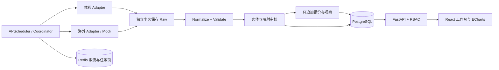

# Architecture

React 19 + TypeScript + Vite + Ant Design + TanStack Query + React Router + ECharts。
FastAPI + SQLAlchemy 2 + Alembic + PostgreSQL + Redis + APScheduler。

Python 使用单发行包 `apps/api/src/jc`，按 providers、ingestion、entities、odds、jobs 划分边界。
不重复建立可独立运行的微服务，避免无必要的部署复杂度。任务接口可由 Celery 接管。
请求链路：Adapter → 独立事务保存 Raw → Normalize → Validate → 业务事务。
前端不直接访问数据供应商。生产通过 Nginx 同源代理，数据库与 Redis 不暴露公网端口。

## 运行结构

`services/*` 和 `packages/*` 文档说明逻辑边界，不是假装独立部署的微服务。容器采用单 API worker，避免每个 worker 启动独立调度器。

| 边界 | 实现 | 职责 |
| --- | --- | --- |
| Provider SDK | providers/base.py、contracts.py | 统一采集、标准模型、历史能力、错误契约 |
| 传输 | providers/http.py | Raw 优先落库、超时、有限重试、限流、脱敏 |
| 采集 | ingestion.py | 原始事务与业务事务分离、来源隔离、运行记录 |
| 实体 | entities.py、admin.py | UUID 身份、评分、歧义、审核、版本与审计 |
| 赔率 | odds.py、odds_api.py | 批量去重、历史可见性、变化与固定标签 |
| 调度 | jobs.py | 每源独立任务、动态周期、Redis 账号级限速与锁 |
| 管理 | quality.py、auth.py | 数据质量、同步、用户、审计、角色鉴权 |
| 展示 | apps/web/src | 今日比赛、详情、七项导航和登录注册 |

业务层只依赖统一 Adapter。真实供应商与公司不是同一概念：The Odds API 是 provider，其返回的 Pinnacle 等是 bookmaker。只有体彩 Adapter 可以创建主比赛池；外部孤立赛事保存在 provider_matches，不扩大主池。

Raw 在独立事务提交后才解析；验证失败时业务事务回滚，Raw 与失败任务继续可查。映射不确定时保留候选进入 REVIEW/UNMATCHED。时间改变会让确认失效，历史报价保留原绑定版本。

认证采用 Argon2 密码哈希、短期 JWT、哈希存储的刷新令牌轮换和会话撤销。注册只能创建 USER；审核和变更要求 ADMIN，ANALYST 可读取受控管理数据。浏览器令牌只放内存，页面刷新需重新登录。读接口使用统一 JSON 信封和 request_id。

未来可将 Coordinator.execute 作为 Celery 任务入口。当前不引入消息总线、分布式微服务或投注服务。P4-0～P4-2 增加单包 analysis 模块，构建事实 Feature，不运行预测模型。容量、备份和生产加固计划见 BACKLOG 与 OPERATIONS。

认证入口在 Argon2 校验前调用 auth_limits.py。PG 原子 UPSERT 有条件递增配额，限流预算先独立提交，随后 401/409 不会撤回计数；Redis 故障时仍有数据库限流保护。短期桶仅保存带服务密钥的 HMAC 标识，过期清理，不记录原始邮箱、IP 或密码。数据来源限流仍由 Redis 承担，两个边界互不替代。

P4 的 results.py 消费统一 FINAL/REGULATION Contract，继续 Provider → Raw → Normalize → Validate → Store，不建新调度或服务。analysis/visibility.py 在提交后通过独立连接确认不可变输入可见，analysis/features.py 同时检查这些凭据、业务/Raw 时间、历史 MatchVersion 和映射审计，输出独立 append-only FeatureSnapshot。详情展示 API 的历史语义未改；不能将其直接当 Feature 输入。规则及旧数据保守边界见 PHASE4_SPEC。
