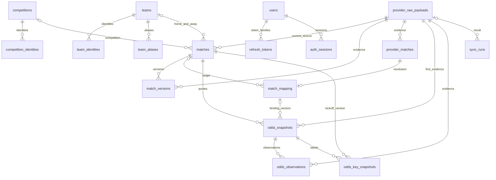

# 数据模型

统一实体：competitions / competition_identities / teams / team_identities / team_aliases。
外部身份通过 `(provider, external_id)` 唯一标识；名称仅作候选提示，不作跨源连接键。
主池 matches 具有 `source='sporttery'` 检查约束。match_versions 保留历史状态。
provider_matches 保存供应商比赛；match_mapping 保存审核状态，audit_logs 记录状态变化。
odds_snapshots 追加存储，dedup_key 唯一；odds_key_snapshots 引用原记录，区分首次观察和供应商初盘。
Raw 与每条业务记录关联，失败同步仍保留 Raw 和 sync_runs。
所有 datetime 使用 UTC；比赛所在地时区未知时为空，来源时区和展示时区独立。
JSON 在 PostgreSQL 为 JSONB；SQLite 仅用于本地开发和快速测试，不代表生产验收。

## ER 关系

`audit_logs` 通过 entity_type / entity_id 指向业务实体，不设多态外键；保存 before/after/reason/actor/request_id。`provider_states` 以 provider 为键记录最新健康状态。

## 关键约束与时间

- 主实体和历史记录均使用 UUID；provider identity、provider match ID 有复合唯一约束。
- 同一供应商对同一体彩比赛最多一个已确认映射，由部分唯一索引约束。审核采用乐观版本避免覆盖其他人的确认。
- 赔率包含 Numeric 价格、原格式赔率、隐含概率、公司/市场/选项/盘口、四个时间字段及 Raw/映射版本。API 中 Decimal 编码为字符串，前端仅用于显示和绘图转换数值。
- Raw、match_versions、odds_snapshots、odds_observations、odds_key_snapshots、audit_logs 有数据库级 UPDATE/DELETE 拒绝触发器。业务修正通过新增版本或审核事件表达。
- 固定标签保存 target_at 与实际 observed_at；旧数据 observed_at 可为空，不能回写补造观察。series_key 包含完整报价序列及映射版本，kickoff_at 保留开球变更版本。
- 所有时间以 UTC timestamptz 入 PG；解析无时区时间必须明确来源时区。未知比赛当地时区保持 NULL。
- 对历史“当时知道什么”的查询同时检查四个时间，并恢复截止时刻的映射审计状态；后补 Raw 不泄漏到此前时点。

## 迁移与索引

五个顺序迁移：初始表 → 不可变触发器 → 观察表 → 观察保护与确认唯一性 → 标签观察时间与审计索引。迁移固定定义，不依赖当前 ORM 自动重建历史 Schema。PG 实测包含 upgrade/head、check 与 downgrade/base 往返。

后续迁移 006 新增 auth_rate_buckets：HMAC key、attempts、expires_at，带过期索引和正数约束；这是可过期的认证控制计数，不是业务历史，不应用 append-only 触发器。当前共六个顺序迁移。

Phase 4 迁移 007_feature_foundation 追加 match_results、team_match_stats、feature_snapshots、analysis_visibility，当前共七个顺序迁移。四表均数据库级 append-only，引用旧 UUID/Raw/比赛版本/映射而不重建旧表。赛后表保存 observed_at、finished_at、created_at 和可空源时间；Feature 的 JSON 在 PG 为 JSONB，唯一键为比赛/cutoff/版本；可见性凭据按不可变表名/行 UUID 唯一，证明独立连接读到已提交事实的最早已记录时间。完整字段/约束和可见性边界见 PHASE4_SPEC。

重点索引包括 `(match_id, provider, market_type, collected_at)`、`(match_id, collected_at, created_at)`、观察时间、销售日、开球时间、映射状态及 `(entity_type, entity_id, created_at)`。当前使用窗口查询取得 latest，未建立会丢历史的覆盖表。
