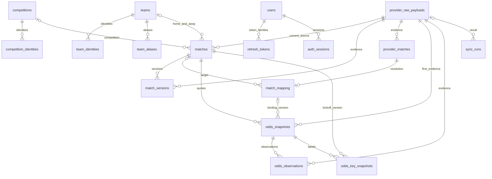

# 数据模型

统一实体：competitions / competition_identities / teams / team_identities / team_aliases。
外部身份通过 `(provider, external_id)` 唯一标识；名称仅作候选提示，不作跨源连接键。
主池 matches 具有 `source='sporttery'` 检查约束。match_versions 保留历史状态。
provider_matches 保存供应商比赛；match_mapping 保存审核状态，audit_logs 记录状态变化。
odds_snapshots 追加存储，dedup_key 唯一；odds_key_snapshots 引用原记录，区分首次观察和供应商初盘。
Raw 与每条业务记录关联，失败同步仍保留 Raw 和 sync_runs。
所有 datetime 使用 UTC；比赛所在地时区未知时为空，来源时区和展示时区独立。
JSON 在 PostgreSQL 为 JSONB；SQLite 仅用于本地开发和快速测试，不代表生产验收。

## ER 关系

`audit_logs` 通过 entity_type / entity_id 指向业务实体，不设多态外键；保存 before/after/reason/actor/request_id。`provider_states` 以 provider 为键记录最新健康状态。

## 关键约束与时间

- 主实体和历史记录均使用 UUID；provider identity、provider match ID 有复合唯一约束。
- 同一供应商对同一体彩比赛最多一个已确认映射，由部分唯一索引约束。审核采用乐观版本避免覆盖其他人的确认。
- 赔率包含 Numeric 价格、原格式赔率、隐含概率、公司/市场/选项/盘口、四个时间字段及 Raw/映射版本。API 中 Decimal 编码为字符串，前端仅用于显示和绘图转换数值。
- Raw、match_versions、odds_snapshots、odds_observations、odds_key_snapshots、audit_logs 有数据库级 UPDATE/DELETE 拒绝触发器。业务修正通过新增版本或审核事件表达。
- 固定标签保存 target_at 与实际 observed_at；旧数据 observed_at 可为空，不能回写补造观察。series_key 包含完整报价序列及映射版本，kickoff_at 保留开球变更版本。
- 所有时间以 UTC timestamptz 入 PG；解析无时区时间必须明确来源时区。未知比赛当地时区保持 NULL。
- 对历史“当时知道什么”的查询同时检查四个时间，并恢复截止时刻的映射审计状态；后补 Raw 不泄漏到此前时点。

## 迁移与索引

五个顺序迁移：初始表 → 不可变触发器 → 观察表 → 观察保护与确认唯一性 → 标签观察时间与审计索引。迁移固定定义，不依赖当前 ORM 自动重建历史 Schema。PG 实测包含 upgrade/head、check 与 downgrade/base 往返。

后续迁移 006 新增 auth_rate_buckets：HMAC key、attempts、expires_at，带过期索引和正数约束；这是可过期的认证控制计数，不是业务历史，不应用 append-only 触发器。当前共六个顺序迁移。

Phase 4 迁移 007_feature_foundation 追加 match_results、team_match_stats、feature_snapshots、analysis_visibility，当前共七个顺序迁移。四表均数据库级 append-only，引用旧 UUID/Raw/比赛版本/映射而不重建旧表。赛后表保存 observed_at、finished_at、created_at 和可空源时间；Feature 的 JSON 在 PG 为 JSONB，唯一键为比赛/cutoff/版本；可见性凭据按不可变表名/行 UUID 唯一，证明独立连接读到已提交事实的最早已记录时间。完整字段/约束和可见性边界见 PHASE4_SPEC。

重点索引包括 `(match_id, provider, market_type, collected_at)`、`(match_id, collected_at, created_at)`、观察时间、销售日、开球时间、映射状态及 `(entity_type, entity_id, created_at)`。当前使用窗口查询取得 latest，未建立会丢历史的覆盖表。

## P4-3 Market Snapshot

迁移 `008_market_probability`（前置 `007_feature_foundation`）仅增加 `market_model_snapshots`，当前共八个顺序迁移。旧 Feature 内容和约束不变。

| 字段 | PostgreSQL 类型 / 约束 |
| --- | --- |
| id | UUID 主键 |
| match_id | UUID NOT NULL，FK → matches.id；从 Feature 复制，不读当前 Match |
| feature_snapshot_id | UUID NOT NULL，FK → feature_snapshots.id |
| analysis_cutoff | timestamptz NOT NULL，从 Feature 复制 |
| market_model_version | varchar(60) NOT NULL，当前 market-v1 |
| normalization_method | varchar(60) NOT NULL，当前 proportional-v1 |
| market_data | JSONB NOT NULL；SQLite 为 JSON |
| mock | boolean NOT NULL，从 Feature 复制 |
| created_at | timestamptz NOT NULL，仅为物化时间，不参与计算 |

唯一约束 `uq_market_feature_version(feature_snapshot_id, market_model_version)` 支持幂等和并发；`market_not_future` 检查 cutoff ≤ created_at。复用 immutability helper 创建 UPDATE / DELETE 拒绝触发器，不设级联删除。降级 008 → 007 仅移除 Market 表及其触发器，不改 Feature、报价或可见性历史。

`market_data` 保存来源市场、完整性、逐项原始/去水概率、overround/vig、外部共识、体彩独立分布、概率差、单序列变化及 diagnostics。核心小数全部存字符串。source identity 是 provider + bookmaker；跨 Provider 同一真实公司可能重复覆盖，V1 不自动实体消歧或去重。

## P4-4D2A Research Persistence

Migration `009_research_dataset_persistence`，前置 008，当前共九个顺序迁移；001～008 不变。独立 Core metadata 的六表及所有 FK 均在 research_* 内，没有任何 LIVE FK 或写入路径。所有表使用 UUID 主键与 created_at；UTC 时间、JSONB（SQLite JSON）与不可变证据规则见 [ADR-014](DECISIONS/ADR-014-research-dataset-persistence.md)。

| 表 | 主要业务字段 / 约束 |
| --- | --- |
| research_datasets | dataset_key + dataset_version 唯一；replay_version、status、description、manifest_json（用户 manifest + 冻结 source_manifest）、content_hash、quality_summary、sealed_at。contract.dataset_id 映射 dataset_key，存储 id 是另一个 UUID |
| research_sources | dataset_id、source_name、source_type、provider_name、license_note、retrieval_note、base_url、verification_status、verified_at、verification_note；(dataset_id, source_name) 唯一；fixture 固定 UNVERIFIED |
| research_raw_artifacts | dataset/source、artifact_type、external_ref、retrieved_at、content_hash、content_type、payload、metadata；(dataset_id, source_id, content_hash) 唯一；hash 幂等，冲突元数据不覆盖 |
| research_matches | research_match_id、sporttery_match_id、competition_id、home/away_team_id、kickoff_at、source_id/source_record_id、四种来源时间/basis、raw_artifact_id、sporttery_verification_status、sporttery_verification_artifact_id；(dataset_id, research_match_id) 与 (dataset_id, source_id, source_record_id) 分别唯一 |
| research_odds_quotes | record_id、research_match_id、source_id/provider/bookmaker、market_type/selection、line/decimal_odds、published/effective/replay_available_at/basis、raw_artifact_id；(dataset_id, record_id) 唯一 |
| research_results | record_id、research_match_id、home/away_team_id、home/away_score、finished_at、source_id、published/effective/replay_available_at/basis、score_scope、raw_artifact_id；(dataset_id, record_id) 唯一；只允许 REGULATION |

line/decimal_odds 在 PostgreSQL 为无固定 scale 的 NUMERIC；SQLite 用 TEXT 保存 Decimal 的精确十进制值，避免 Numeric 经浮点驱动舍入。写入/Seal/Load 都执行冻结 D1 contract 的数值和有限性校验，不截断到六位小数。比分为非负整数。

可用时间/basis 必须同时 NULL 或同时存在，basis 为 SOURCE_SNAPSHOT_AT、PROVIDER_PUBLISHED_AT、PROVIDER_EFFECTIVE_AT、VERIFIED_ARCHIVE_TIMESTAMP；provider basis 的等值证据由 CHECK 和 contract 双重验证。Result finished_at > Match kickoff_at 的跨表关系由触发器约束，available_at ≥ finished_at（或 NULL）由 CHECK 约束，已知球队 ID 不能矛盾。

Raw 复合 FK `(dataset_id, source_id, raw_artifact_id)` 强制每条成员同源取证。VERIFIED 体彩 FK 指向同 dataset 的官方历史工件，触发器检查官方来源、验证状态与该比赛 ID/球队/kickoff 证据；默认 UNVERIFIED，非空体彩 ID 无法单独证明开售。

五张成员表 UPDATE/DELETE 触发器始终拒绝，INSERT 只允许父 dataset BUILDING。datasets 只能 BUILDING→SEALED/REJECTED，其他字段不可改，禁止删除或直接创建终态。PostgreSQL 同时拒绝 TRUNCATE。封存 hash、质量统计与时钟仅在合法 SEALED 转移时填入；业务内容通过内部 Seal 完整验证，Load 再验 hash/统计。

索引：matches(dataset_id, kickoff_at)、odds(dataset_id, research_match_id, provider, bookmaker, market_type)、results(dataset_id, research_match_id)、raw(dataset_id, source_id)。没有分区、研究 Feature 表或模型表。

quality_summary 包含比赛/已验证体彩目标/赔率/赛果/来源数量、有/无 availability 证据的记录数量、缺球队身份的比赛/赛果数量、开球时间 date_min/max；无主观质量分。Raw SHA-256 和 Dataset SHA-256 分开，UUID/创建时钟不参与内容 hash。
